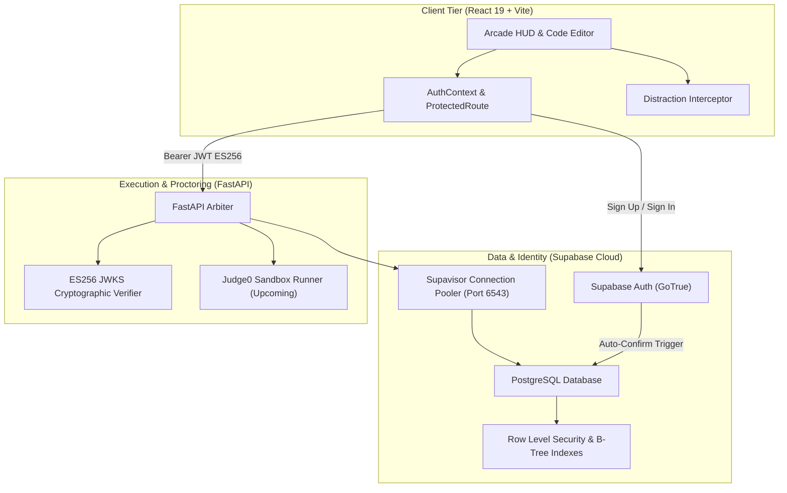

# CTRL_ALT_DISTRACT

> **High-Concurrency Competitive Programming & Real-Time Cognitive Distraction Platform**  
> *Built for GDG on Campus Hackathons & Programming Arenas.*

[](https://react.dev/)
[](https://www.typescriptlang.org/)
[](https://vitejs.dev/)
[](https://tailwindcss.com/)
[](https://supabase.com/)
[](https://fastapi.tiangolo.com/)
[](https://www.docker.com/)

---

## 1. System Architecture Overview

**CTRL_ALT_DISTRACT** is an arcade-themed algorithmic competition engine where participants tackle 10 progressive DSA problems while surviving random, unskippable 30–60 second interactive cognitive disruptions.

The platform follows a zero-trust, server-authoritative architecture:
- **Client (Frontend)**: Renders a retro-terminal arcade interface (CRT scanlines, mechanical keycaps, code editor HUD, distraction viewports).
- **Identity & Data Tier (Supabase Cloud)**: Manages authentication, user profiles, transactional event states, and sub-millisecond index lookups.
- **Backend Service (FastAPI)**: Validates public `ES256` JWKS tokens, acts as an authoritative contest arbiter, and orchestrates sandboxed code execution.



---

## 2. Repository Structure

```
CTRL_ALT_DISTRACT/
├── src/                          # React 19 + TypeScript + Vite Frontend
│   ├── assets/                   # Static visual assets & CRT overlays
│   ├── components/               # Modular arcade UI primitives
│   │   ├── headers/              # AppHeader, LobbyHeader, PublicHeader
│   │   ├── leaderboard/          # Podium & Leaderboard table components
│   │   ├── ui/                   # Button, Badge, Input primitives
│   │   ├── ArcadeDino.tsx        # Interactive retro dino runner
│   │   ├── CrtMonitor.tsx        # Scanline CRT viewport wrapper
│   │   ├── Logo.tsx              # Keycap brand mark
│   │   ├── ProtectedRoute.tsx    # RBAC route guard (Player vs Admin)
│   │   └── Rulebook.tsx          # Interactive rules drawer
│   ├── context/                  # Global state providers
│   │   └── AuthContext.tsx       # Live Supabase session & profile synchronization
│   ├── lib/                      # Utilities & configuration
│   │   ├── data.ts               # Competition metadata & sample schemas
│   │   ├── eventStore.ts         # Reactive event state machine
│   │   ├── highlight.tsx         # Syntax highlighter
│   │   ├── supabase.ts           # Supabase client instantiation
│   │   └── utils.ts              # Tailwind className merge helper (cn)
│   ├── pages/                    # Routed application views
│   │   ├── arena/                # Complete IDE, HUD, Test Runner & Distraction Modal
│   │   ├── Admin.tsx             # Proctor console with live event controls
│   │   ├── Complete.tsx          # Final score & accuracy summary
│   │   ├── Dashboard.tsx         # Participant mission control & pre-flight checklist
│   │   ├── Landing.tsx           # Public hero page with CRT terminal
│   │   ├── Leaderboard.tsx       # Paginated real-time ranking table
│   │   ├── Lobby.tsx             # Pre-contest waiting room & countdown
│   │   ├── Login.tsx             # Live sign-in / sign-up with role selector
│   │   ├── NotFound.tsx          # Arcade 404 screen
│   │   └── Rules.tsx             # Full tournament regulations
│   ├── App.tsx                   # Route definitions & provider tree
│   ├── index.css                 # Tailwind v4 theme & CRT design tokens
│   └── main.tsx                  # React DOM entrypoint
├── backend/                      # FastAPI Python Service
│   ├── auth.py                   # JWKS public key resolver & ES256/HS256 validator
│   ├── main.py                   # Protected API endpoints & CORS middleware
│   ├── Dockerfile                # Production-ready backend container
│   ├── requirements.txt          # Python dependencies
│   └── .env.example              # Backend environment template
├── supabase/                     # Database Migrations & Policies
│   └── migrations/
│       ├── 001_create_profiles_and_roles.sql   # Profiles table, RLS & auto-sync trigger
│       ├── 002_auto_confirm_users.sql          # Zero-delay email auto-confirm trigger
│       ├── 003_confirm_all_existing_users.sql  # Backfill confirmation for early signups
│       └── 004_performance_indexes.sql        # High-concurrency B-Tree indexes
├── docker-compose.yml            # Multi-service local orchestrator
├── package.json                  # Frontend dependencies & scripts
├── tsconfig.json                 # TypeScript compiler configuration
└── vite.config.ts                # Vite build configuration with Tailwind v4
```

---

## 3. Core Features & Functional Status

| Module | Feature | Implementation Details | Status |
|---|---|---|---|
| **Auth** | User Registration | Real-time signup with role tagging (`participant` / `admin`). | ✅ **Live** |
| **Auth** | High-Volume Rate Limit Bypass | PostgreSQL `BEFORE INSERT` trigger auto-confirms accounts, eliminating SMTP 3/hr bottlenecks. | ✅ **Live** |
| **Auth** | Profile Synchronization | PostgreSQL trigger auto-populates `public.profiles` on `auth.users` insert. | ✅ **Live** |
| **Auth** | User Sign-In | `signInWithPassword` producing verifiable `ES256` JWTs persisted in `localStorage`. | ✅ **Live** |
| **Auth** | Role-Based Redirection | Directs `admin` users to `/admin` and `participant` users to `/dashboard`. | ✅ **Live** |
| **Security** | Route Protection | `ProtectedRoute` wrapper guarding participant and admin routes with loading fallback. | ✅ **Live** |
| **Backend** | Token Verification | Live verification using Supabase JWKS public keys (`/.well-known/jwks.json`). | ✅ **Live** |
| **Database** | Concurrency Tuning | B-Tree indexes on `profiles(role)`, `profiles(email)`, and `profiles(created_at)`. | ✅ **Live** |
| **Database** | Connection Pooler | Supavisor pooler configured for high-concurrency transaction bursts (Port 6543). | ✅ **Live** |
| **UI** | Arena IDE | Syntax-highlighted editor, HUD timer, round tracking, and problem descriptions. | ✅ **Live** |
| **Execution**| Sandboxed Code Runner | Judge0 integration for sandboxed multi-language testing. | ⏳ *Next Milestone* |
| **Engine** | Distraction Games | Porting the 10 minigames from `origin/Distraction/Heet` into the Arena. | ⏳ *Next Milestone* |
| **Realtime** | Network State Sync | Supabase Realtime / WebSockets broadcast for live countdowns and proctor alarms. | ⏳ *Next Milestone* |

---

## 4. Security & Concurrency Design

### High-Concurrency Registration (1,000+ Concurrent Students)
Default cloud auth providers enforce aggressive rate limits on verification emails (typically 3 emails/hour on free tiers). For live hackathons with hundreds of students logging in simultaneously, this creates an immediate point of failure.

**Solution Implemented**:
```sql
-- Automatically confirm users on creation to bypass SMTP throttling
CREATE OR REPLACE FUNCTION public.auto_confirm_user()
RETURNS trigger AS $$
BEGIN
    NEW.email_confirmed_at = NOW();
    RETURN NEW;
END;
$$ LANGUAGE plpgsql SECURITY DEFINER;

CREATE TRIGGER tr_auto_confirm_user
BEFORE INSERT ON auth.users
FOR EACH ROW
EXECUTE FUNCTION public.auto_confirm_user();
```

### Cryptographic Token Verification
The FastAPI backend avoids shared-secret synchronization risks by retrieving Supabase's live public JSON Web Key Set (JWKS) via `ES256` asymmetric encryption.

```python
# Authenticates Bearer tokens directly against Supabase public cryptographic keys
jwks_client = jwt.PyJWKClient("https://<project-ref>.supabase.co/auth/v1/.well-known/jwks.json")
signing_key = jwks_client.get_signing_key_from_jwt(token)
payload = jwt.decode(token, signing_key.key, algorithms=["ES256"], audience="authenticated")
```

---

## 5. Getting Started

### Prerequisites
- **Node.js**: `v18.0.0` or higher
- **Python**: `v3.10` or higher (for backend)
- **Docker**: Optional (for containerized execution)

### 1. Frontend Setup

1. **Clone the repository and install dependencies**:
   ```bash
   git checkout ayush
   npm install
   ```

2. **Configure environment variables**:
   Create a `.env` file in the root directory:
   ```env
   VITE_SUPABASE_URL=https://<your-project-id>.supabase.co
   VITE_SUPABASE_ANON_KEY=your-supabase-anon-key
   VITE_API_URL=http://localhost:8000
   ```

3. **Run the Vite development server**:
   ```bash
   npm run dev
   ```
   The application will be live at `http://localhost:5173`.

4. **Run production build**:
   ```bash
   npm run build
   ```

---

### 2. Backend Setup (FastAPI)

1. **Navigate to the backend directory and set up a virtual environment**:
   ```bash
   cd backend
   python -m venv venv
   source venv/bin/activate  # On Windows: venv\Scripts\activate
   pip install -r requirements.txt
   ```

2. **Configure backend `.env`**:
   ```env
   SUPABASE_URL=https://<your-project-id>.supabase.co
   SUPABASE_ANON_KEY=your-supabase-anon-key
   SUPABASE_SERVICE_ROLE_KEY=your-service-role-key
   DATABASE_URL=postgresql://postgres:[PASSWORD]@[POOLER-HOST]:6543/postgres
   ```

3. **Start the FastAPI server**:
   ```bash
   uvicorn main:app --host 0.0.0.0 --port 8000 --reload
   ```
   Interactive OpenAPI documentation will be available at `http://localhost:8000/docs`.

---

### 3. Docker Compose (Full Stack)

To spin up the backend and local services via Docker:
```bash
docker-compose up --build -d
```

---

## 6. Routes Inventory

| Route | View | Access Level | Description |
|---|---|---|---|
| `/` | `Landing.tsx` | Public | Hero terminal, event breakdown, and dynamic sign-in status. |
| `/rules` | `Rules.tsx` | Public | Interactive rulebook, scoring algorithm, and guidelines. |
| `/login` | `Login.tsx` | Public | Real authentication with participant vs. proctor toggle. |
| `/leaderboard`| `Leaderboard.tsx` | Public | Filterable top-10 rankings with podium visualization. |
| `/dashboard` | `Dashboard.tsx` | **Participant** | Player pre-flight checklist and round status. |
| `/lobby` | `Lobby.tsx` | **Participant** | Synchronized player grid and live countdown overlay. |
| `/arena` | `Arena.tsx` | **Participant** | Problem panel, code editor, test output, and distraction overlay. |
| `/complete` | `Complete.tsx` | **Participant** | Post-match performance analytics and accuracy score. |
| `/admin` | `Admin.tsx` | **Proctor Only** | Event lifecycle triggers, live proctoring alerts, and logs. |

---

## 7. Upcoming Roadmap

1. **Judge0 Sandboxed Execution**: Link the frontend code runner to Judge0 worker queues for isolated multi-language code testing.
2. **Minigame Distraction Injection**: Embed the 10 interactive distractions from `origin/Distraction/Heet` (SimonSays, Stroop ColorTrap, TypingChallenge) directly into `src/pages/arena/DistractionModal.tsx`.
3. **Supabase Realtime Broadcast**: Implement channel-based WebSocket events for instant tournament start, synchronized pause, and automatic proctor violation telemetry.

---

## 8. License & Acknowledgments

Developed by **GDG on Campus VIT Mumbai** for the **CTRL_ALT_DISTRACT** competitive coding event.  
Licensed under the [MIT License](LICENSE).
